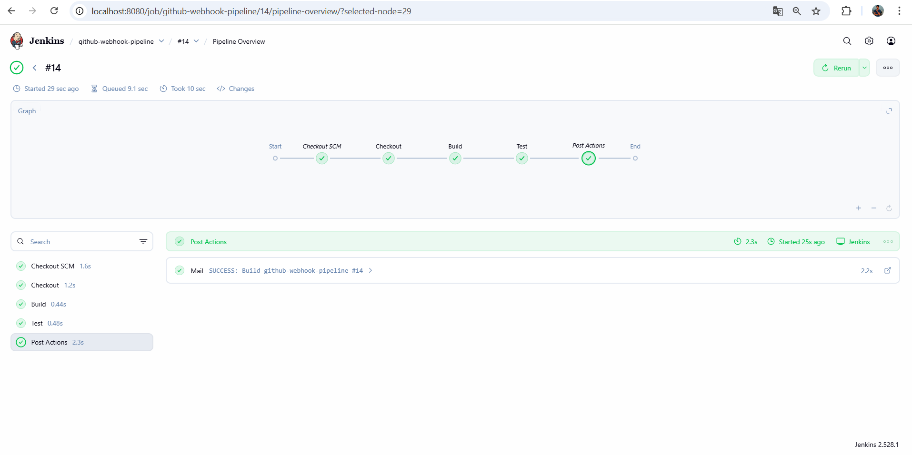
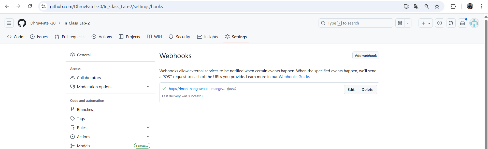
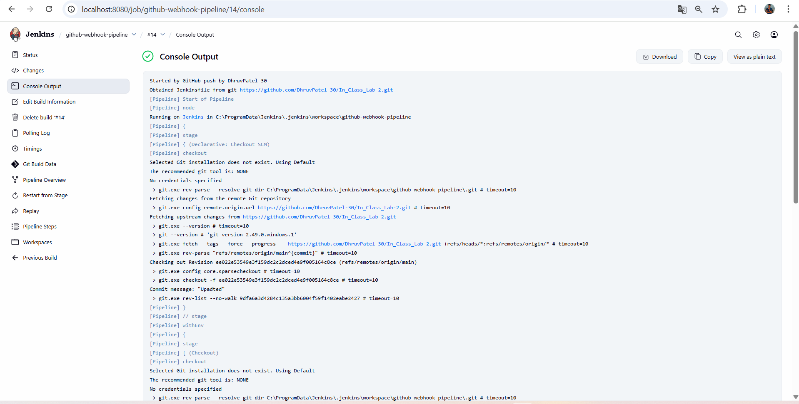
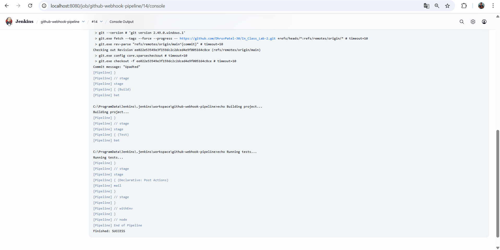
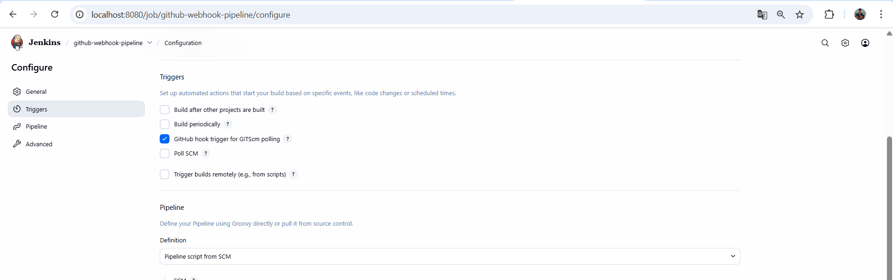
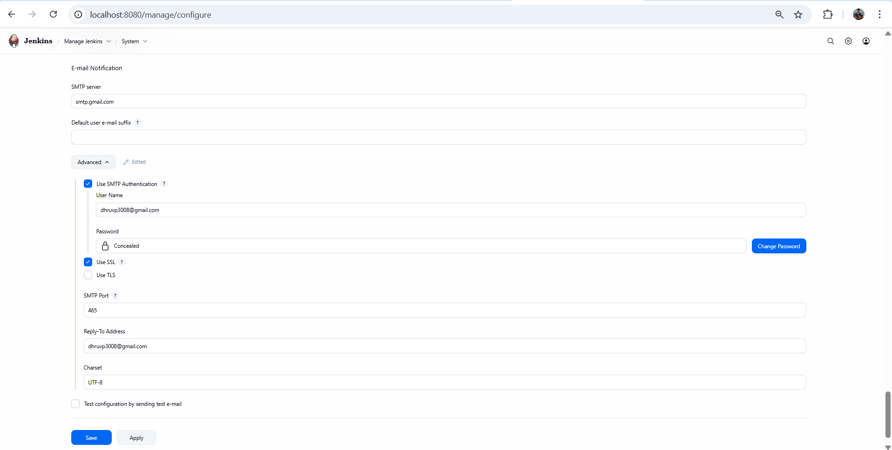
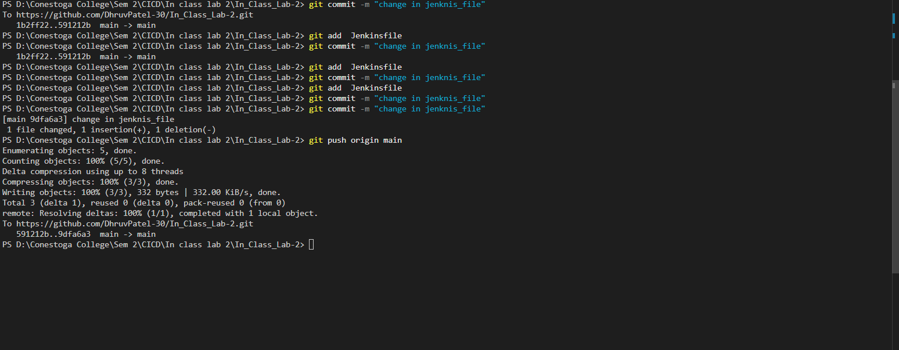
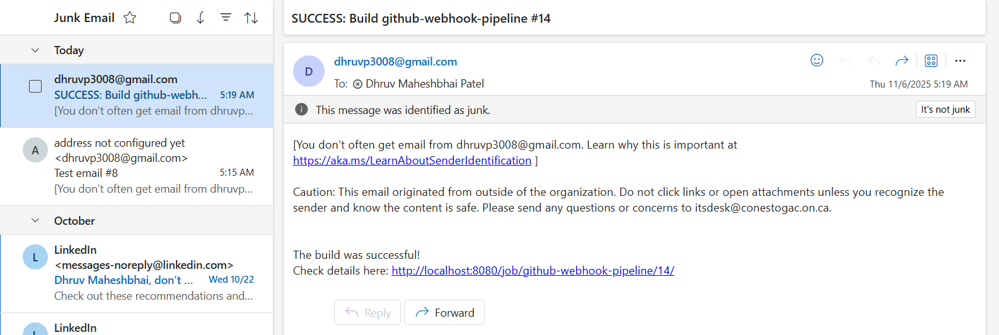

# GitHub Webhook Jenkins CI Pipeline

##  Overview

For this project, I chose to use a webhook method to trigger Jenkins builds automatically whenever changes are pushed to my GitHub repository. This approach ensures faster and more efficient CI/CD automation compared to manual polling. During the setup, I faced some issues with email notifications, as Jenkins was unable to send build status emails through Gmail’s SMTP server. Initially, the connection to Gmail failed due to incorrect SMTP settings and port configuration. I resolved the issue by updating the SMTP server details, enabling SSL/TLS, and properly formatting the email notification configuration in my Jenkins pipeline. After these corrections, the webhook successfully triggered builds, and email notifications worked as expected.
---
Here is screenshots:

